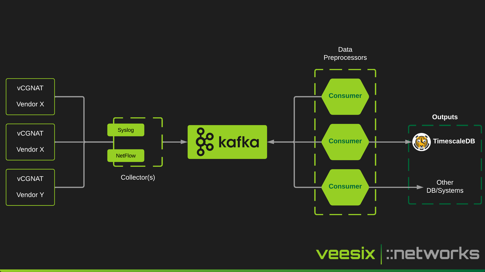

# cgn-ec
CGN Event Correlation

This project is currently a work in progress and will be subject to change core components throughout the next few months.

With this project, I aim to consolidate various methods of collecting CGNAT logs and build the architecture in a way to scale on both the ingestor side and the consumers who will process the data and pass it into external systems like an analysis tool or time-series database. The idea is that you can also enrich the data with some metadata about the CGN subscriber whether that be things like a prefix id, site id or role from your IPAM like netbox to provide quick and reliable reporting on your CGN subscribers.

TimescaleDB was initially chosen to explore the capabilities of running time series in PostgreSQL because the infrastructure can be consolidated alongside with Django/NetBox applications for my initial demos.

If you are interested in funding this project or obtaining a support contract which will allow me to develop this further and provide better support with proper SLAs, then please do reach out to me via [Veesix ::networks](https://veesix-networks.co.uk) or contact me at support[at]veesix-networks.co.uk.