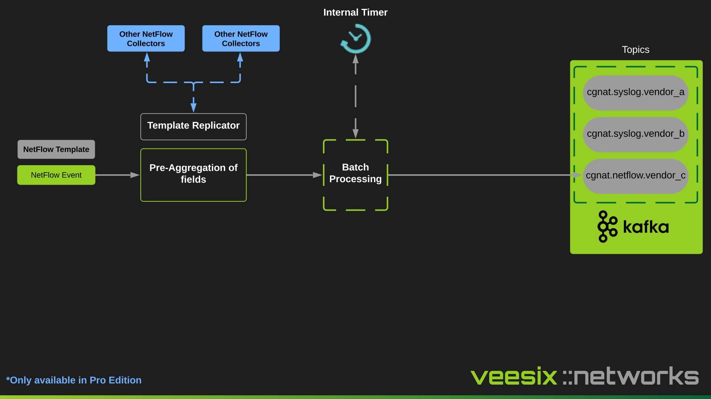
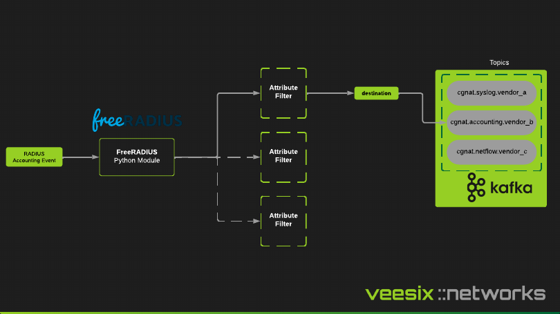

The collector is what "collects" the data and sends it (produces the event) to Kafka. Kafka is essentially a central location for data to enter at an extremely fast pace, and then be streamed to applications which will process the data, normalize it and transform it.

These collectors are typically hand-picked for speed to perform minimal pre-processing on the event (eg. a subscriber port allocation or a new session), currently there are 3 supported collectors out of the box:

- Syslog
- NetFlow (v9)
- RADIUS Accounting

## Syslog

## NetFlow

## RADIUS Accounting

