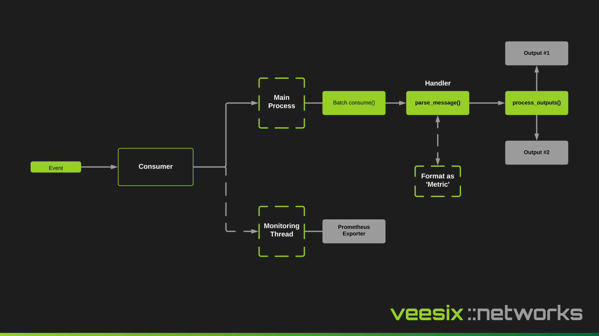

The consumer is what "consumes" the events written into Kafka, pre-processes them into a Metric which then can be handled by an output to store in a database or be sent somewhere else.

The consumer will typically implement vendor specific logic to normalize the event into one of the few Metric models available.

For example if you are looking to ingest a session mapping event from 2 CGNAT vendors but 1 represents the protocol as an integer and the other represents the protocol as a string (e.g 6 for TCP or 17 for UDP), the typical data model for a metric object requires the protocol number so you would implement some logic to transform the string to its integer equivalent.



## Configuration Examples

Consumer configuration is driven via YAML or JSON. When you mount the configuration file to the consumer containers, you should set the `CONFIG_FILE` environment variable to let the consumer know where the configuration file lives.

### YAML

```yaml
# Global Configuration Settings
kafka_bootstrap_servers: "localhost:9094"
kafka_group_id: "syslog-consumers"
kafka_max_records_poll: 500
batch_size: 30000

# Handler Configuration
handler:
  type: "cgn_ec_consumer.handlers.nfware.NFWareSyslogHandler"
  options: {}

# Outputs Configuration
outputs:
  # TimeScaleDB Output
  - type: "cgn_ec_consumer.outputs.timescaledb.TimeScaleDBOutput"
    options:
      address: "tsdb"
      port: 5432
      username: "cgnat"
      password: "password123"
      database: "cgnat"
      batch_size: 30000

  # Example HTTP Output
  # - type: "cgn_ec_consumer.outputs.http.HTTPOutput"
  #   options:
  #     url: "http://example.com/api/metrics"
  #     headers:
  #       Authorization: "Bearer token123"
  #     timeout: 10
```

### JSON

```json
{
  "kafka_bootstrap_servers": "localhost:9094",
  "kafka_group_id": "syslog-consumers",
  "kafka_max_records_poll": 500,
  "batch_size": 30000,
  
  "handler": {
    "type": "cgn_ec_consumer.handlers.nfware.NFWareSyslogHandler",
    "options": {}
  },
  
  "outputs": [
    {
      "type": "cgn_ec_consumer.outputs.timescaledb.TimeScaleDBOutput",
      "options": {
        "address": "tsdb",
        "port": 5432,
        "username": "cgnat",
        "password": "password123",
        "database": "cgnat",
        "batch_size": 30000
      }
    }
  ]
}
```