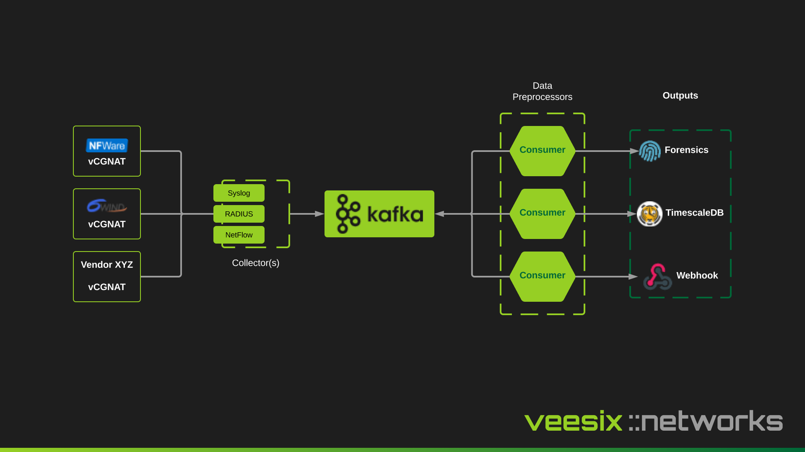

This page documents the general design of cgn-ec. Here you should grasp a quick understanding on how the project is structured. Firstly, here is a basic overview diagram of the full solution before we go into more depth:

## Collector

The collector is what "collects" the data and sends it to Kafka. Kafka is essentially a central location for data to enter at an extremely fast pace, and then be streamed to applications which will process the data, normalize it and transform it.

Collectors are only responsible for getting the data into this common ingestion point which makes them extremely scalable and can process loads of events with minimal processing power.

## Data Preprocessor / Consumer

When an event comes into the Kafka queue, a consumer will typically pick up this message and transform the data, process it and perform an action, whether that be sending the event based on a specific subscriber IP source translation to a webhook, or store every session mapping event in a time-series database.

The consumers scale horiziontally and allow us to introduce more complex data processing without slowing down the initially collection step.

## Outputs

An output is simply a chunk of code that allows any input to be transformed into an external system. When a new collector method is built or a new vendor is introduced, the consumer may implement new code to consume these events but the output uses the same transformed event so that it doesn't require any changes to work with new vendors or new collection methods.