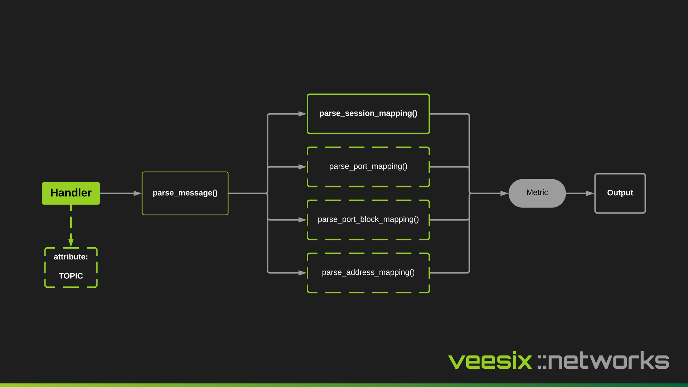

A Handler is the low-level implementation on how to parse an event, typically each vendor will have its own handler and each transport method (Syslog, NetFlow, RADIUS Accounting) will also have its own handler implementation.

A handler will typically inherit either the Base handlers or a Generic handler:

```python
from consumer.handlers.generic import BaseSyslogHandler, GenericSyslogHandler

class MySyslogHandler(BaseSyslogHandler):
    def parse_message(self, message: str) -> dict:
        # parse_message needs to be implemented on all Handlers that inherit the BaseSyslogHandler

class AnotherSyslogHandler(GenericSyslogHandler):
    pass
```

## Typical Design of a Handler

Each handler should implement at a minimum the `parse_message` method. This should be responsible for determining which type of metric it is and passing into a relevant method to perform the preprocessing/data normalization. It's not a requirement to implement the 4 methods for parsing `session`, `port`, `port_block` and `address` because not all vendors will support these but at a minimum `parse_session_mapping` should be implemented.

These methods will normalize the data from the relevant collection method into a metric which can be processed by an output. Each metric must contain key named `type` of which the value type must be `NATEventEnum`, as shown below:

```python
class NATEventEnum(str, Enum):
    ADDRESS_MAPPING = "address-mapping"
    PORT_MAPPING = "port-mapping"
    PORT_BLOCK_MAPPING = "port-block-mapping"
    SESSION_MAPPING = "session-mapping"
```

Outputs are then configured to use this event to determine further logic, for example, which database table it will be inserted into for the TimescaleDB output.

