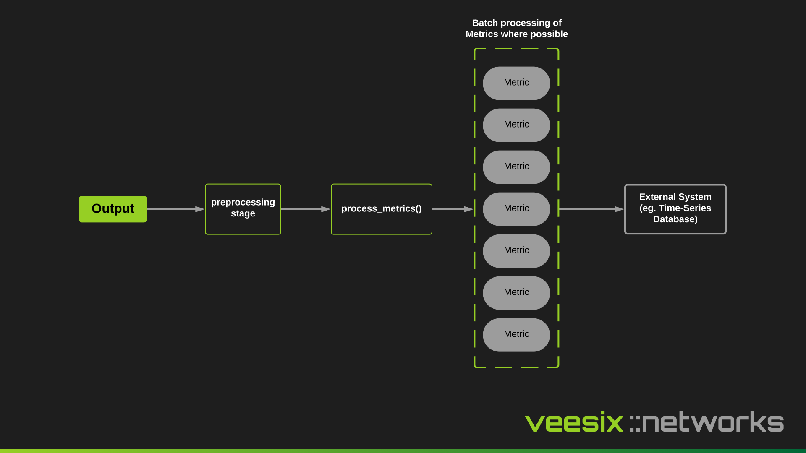

An output is an implementation to send the processed event to an external system, like a database, back into Kafka or for example a HTTP endpoint.

Outputs must only process metrics and not perform any processing steps to change the data. Outputs are designed to work with any handler type so it doesn't matter what vendor or data you are ingesting, the output will work regardless.



## Supported Outputs

### TimescaleDB

Time-series based database built around PostGRES. This is our preferred output when storing long lived data due to the compression techniques used to be able to store the most amount of logs and is a validated design.

```yaml
outputs:
  - type: "TimeScaleDBOutput"
    options:
      address: "tsdb"
      port: 5432
      username: "cgnat"
      password: "password123"
      database: "cgnat"
      batch_size: 30000
```

| Name | Description |
| --- | --- |
| address | TimescaleDB host to connect to. |
| port | TCP port to connect to. |
| username | Username for authentication. |
| password | Password for authentication. |
| database | Database to connect to. |
| batch_size | How many metrics to batch in a bulk insert. |

### HTTP

HTTP based webhook to send a HTTP request to a configured endpoint.

```yaml
outputs:
  - type: "HTTPWebhookOutput"
    options:
      url: "http://webhook/metrics"
      headers:
        x-api-key: default-change-me
      timeout: 10
```

| Name | Description |
| --- | --- |
| url | URL to send payload to. |
| headers | Extra headers to add to the HTTP request |
| timeout | requests Session timeout |

### Kafka

Kafka Producer Output to send events back into the existing CGN-EC Kafka or a different Kafka after processing the metrics.

```yaml
outputs:
- type: "KafkaOutput"
    options:
      bootstrap_servers: "localhost:9094"
      topic: "cgnat.events"
      default_topic: "sometopic.all"
      topic_event_map:
        session-mapping: "sometopic.for.sessionmapping"
        address-mapping: "sometopic.for.addressmapping"
      key_field: "x_ip"
      producer_extra_config: {}
```

| Name | Description |
| --- | --- |
| bootstrap_servers | Kafka Bootstrap Servers. |
| topic | If populated, all events get sent to this specific topic, can be empty. |
| default_topic | When used with topic_event_map, any events not captured in the map will be sent to this topic. |
| topic_event_map | Used to map specific events (eg. `session-mapping`) to a specific topic. |
| key_field | Checks if field exist in the metric, and sets the key for the produced event. Typical options are `x_ip`, `x_port`, `src_ip`, `dst_ip` and `dst_port`. |
| producer_extra_config | Extra configuration to pass into the Kafka Producer (eg. SSL configuration). |

### Redis

Use Redis Cache to store events and update them in real-time. Typically `src_ip` is the best field to track in a cache.

```yaml
outputs:
  - type: "RedisOutput"
    options:
      host: redis
      port: 6379
      key_field: src_ip
      key_ttl: 900
      key_event_map:
        session-mapping: cgnat:events:sessionmapping
      redis_extra_config:
        password: example
```

| Name | Description |
| --- | --- |
| host | Redis Host. |
| port | Redis Port. |
| key_field | Field to use in the redis key. |
| key_ttl | Sets expiration for the key. |
| key_event_map | Used to prepend to the key for specific events (eg. `session-mapping`), by default: `cgnat:events:<event_type>:<key_field>`. |
| redis_extra_config | Extra config to pass into the Redis class. Eg. Auth/TLS/etc |

## Preprocessors

Preprocessors can be attached to an output to perform logic such as filtering specific keys or checking a certain key/value pair exist. Here are some scenarios where you could apply a preprocessor to a relevant output:

- You need to filter a few fields and specifically target a `src_ip` of `100.64.22.13` and the `dst_port` field must exist, then send this to a HTTP API for further processing. In this scenario you can use the `HTTPWebhookOutput` output combined with the `filter_keys`, `match_kvs` and `key_exists` preprocessors.
- You need to send events for a specific `src_ip` to a Kafka queue for further processing. In this scenario you can use the `KafkaOutput` output combined with the `match_kvs` preprocessor.
- You need to temporarily drop any metrics with a specific `dst_ip` and `dst_port`. You can use the `BlackholeOutput` output combined with the `match_kvs` preprocessor.

### Preprocessor config example
```yaml
outputs:
  - type: "HTTPWebhookOutput"
    options:
      url: "http://webhook/metrics"
      headers:
        x-api-key: default-change-me
      timeout: 10
    preprocessors:
      - name: filter_keys
        arguments:
          keys:
            - src_ip
            - src_port
            - x_ip
            - x_port
            - timestamp
            - dst_ip
            - dst_port
            - event
      - name: match_kvs
        arguments:
          kvs:
            src_ip: 192.168.3.30
      - name: key_exists
        arguments:
          key: dst_port
          ignore_none: true
```

You can view [more details on preprocessors here](./preprocessors.md).