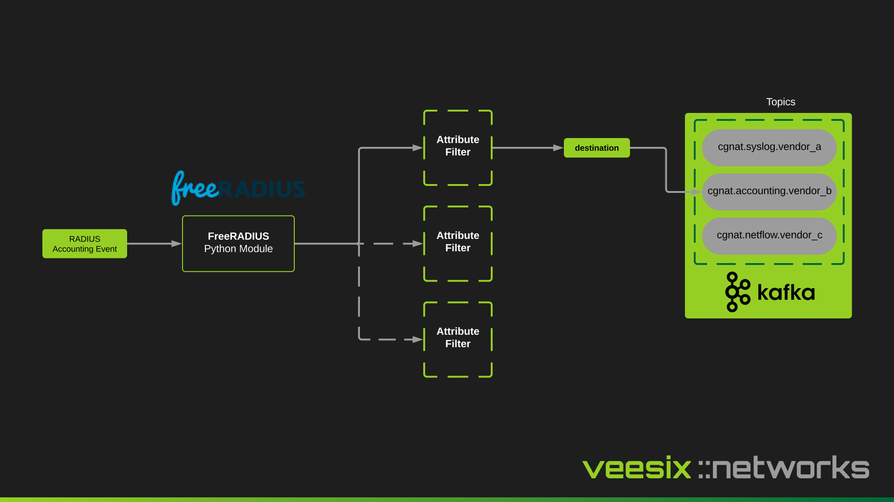

## RADIUS Accounting

The `cgn-ec-producer-radius` container image is based on [FreeRADIUS (v3)](https://www.freeradius.org/releases/) with a custom python module to send accounting events into Kafka.

Using config attributes, a policy is defined to tag specific accounting messages with an attribute `Veesixnetworks-CGN-EC-Kafka-Topic` based on the different vendor logic (eg. certain RADIUS attributes the vendor defines) and then this is used in the python module to route the message to the correct Kafka topic after converting the accounting tuples to JSON.