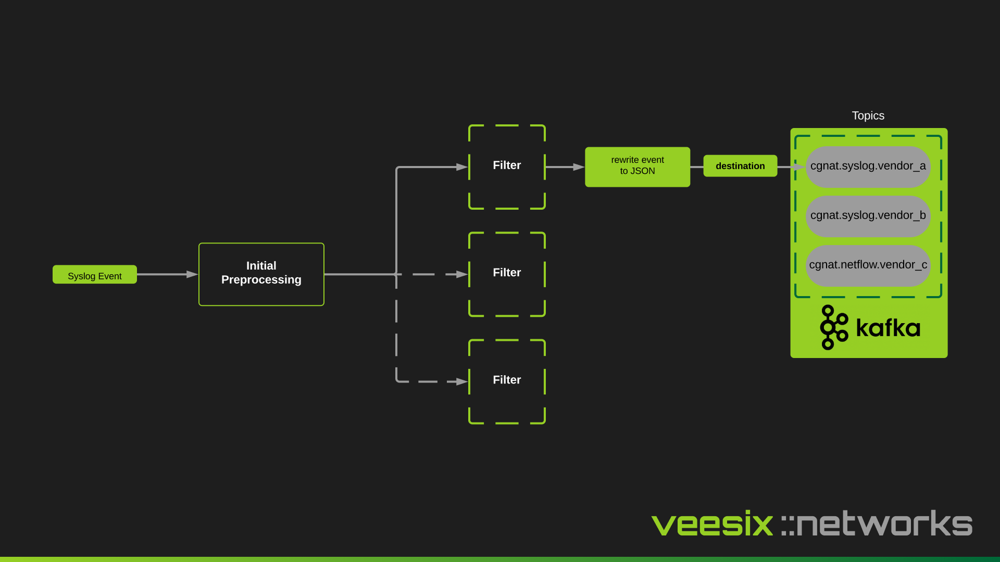

## Syslog

The syslog producer is based on syslog-ng but with a python entrypoint that handles the configuration for various vendors and regex patterns.



## Configuration

You can mount a configuration file at `/etc/cgn_ec/syslog.yaml` and introduce more vendors, disable all the vendors you don't use, and also redefine the regex pattern which is used to capture the event and send it into the message queue, ready to be normalized by the `cgn-ec-consumer`.

```yaml
vendors:
  - name: a10_thunder
    enabled: true
    regex_map:
      default_pattern: 'NAT-(UDP|TCP|ICMP)-\w+:.*$'
  - name: nfware
    enabled: true
    regex_map:
      default_pattern: '[A|D] VRF (\d+|\d+ INT).*EXT \d{1,3}(?:\.\d{1,3}){3}.*$'
  - name: juniper
    enabled: true
    regex_map:
      default_pattern: '(RT_FLOW_SESSION_CREATE|RT_FLOW_SESSION_CLOSE|RT_SRC_NAT_PBA_ALLOC|RT_SRC_NAT_PBA_INTERIM|RT_SRC_NAT_PBA_RELEASE)'
  - name: f5_bigip
    enabled: true
    regex_map:
      default_pattern: '(LSN_ADD|LSN_DELETE|LSN_INBOUND_ADD|LSN_INBOUND_DELETE).*$'
  - name: sixwind
    enabled: true
    regex_map:
      default_pattern: '^(fp-cgnat)\[\d+\]: (NEW CONN|DESTROY CONN|CGNAT|USER).*$'
```

You can override the 4 patterns under the `regex_map`:

- session_mapping
- address_mapping
- port_mapping
- port_block_mapping

A useful scenario here would be if you wanted to only capture the port block allocation logs for a vendor and no other logs, you can either override either the `default_pattern` or implement `port_block_mapping` like so:

```yaml
vendors:
      default_pattern: '[A|D] VRF (\d+|\d+ INT).*EXT \d{1,3}(?:\.\d{1,3}){3}.*$'
  - name: juniper
    enabled: true
    regex_map:
      port_block_mapping: '(RT_SRC_NAT_PBA_ALLOC|RT_SRC_NAT_PBA_INTERIM|RT_SRC_NAT_PBA_RELEASE)'
```

This then generates the relevant filters, destinations and log snippets for the `syslog-ng` based config.

### Docker Compose example

Mount your `syslog.yaml` into `/etc/cgn_ec/syslog.yaml` under the `syslog_collector` service here:

```yaml
services:
  syslog_collector:
    image: veesixnetworks/cgn-ec-producer-syslog:v1.0.0
    ...
    volumes:
      - ./syslog.yaml:/etc/cgn_ec/syslog.yaml # HERE
```

You should then see logs on the vendors that have been enabled:

```
Attaching to cgn_ec_producer_syslog-1
cgn_ec_producer_syslog-1  | ✅ Configuration validation passed!
cgn_ec_producer_syslog-1  | Attempting to enable the following vendors:
cgn_ec_producer_syslog-1  | - a10_thunder (includes default_pattern match)
cgn_ec_producer_syslog-1  | - nfware (includes default_pattern match)
cgn_ec_producer_syslog-1  | - juniper (includes default_pattern match)
cgn_ec_producer_syslog-1  | - f5_bigip (includes default_pattern match)
cgn_ec_producer_syslog-1  | - sixwind (includes default_pattern match)
cgn_ec_producer_syslog-1  | 
cgn_ec_producer_syslog-1  | 🚀 Starting cgn-ec-syslog-producer
```