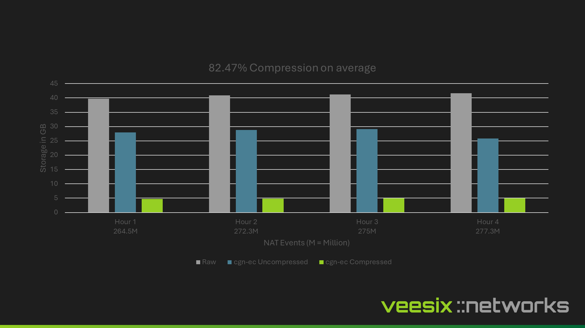
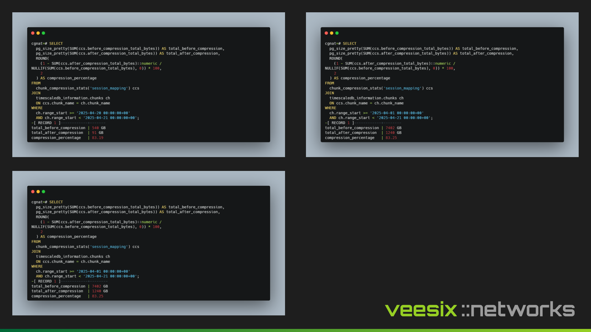

# Real-World Compression Examples

TimescaleDB's native compression can dramatically reduce storage requirements for CGNAT and event correlation data. Here are real-world examples from our testing environment.

The `raw` metric is based on the average of multiple syslog and netflow capture methods across different software solutions, including Graylog, Logstash, pmacctd, and nfdumpd.

# Raw SQL Queries

Still not convinced?

Here are direct examples from the TimescaleDB test database — raw SQL outputs, without any API layers — showing real compression results:

## Why does it matter

In high-throughput environments, compression significantly reduces disk usage, allowing you to store much larger datasets without the need for constant storage upgrades.

With lower storage requirements, you can retain CGNAT event logs for longer periods, which is essential for supporting third-party requests — such as law enforcement inquiries for subscriber data.