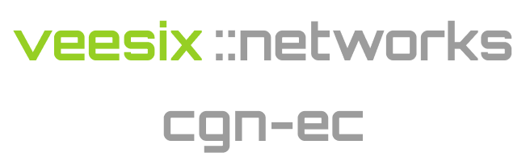

#
<p align="center">
  
</p>

<a href="https://github.com/veesix-networks/cgn-ec" target="_blank">cgn-ec</a> (Event Correlation) is a super fast and flexible solution which focuses on centralizing CGNAT logging. You can view the [documentation here](https://docs.cgn-ec.veesix-networks.co.uk) and also join the [Slack](https://join.slack.com/t/cgn-ec/shared_invite/zt-2wvt40sc7-h5l3VWjYkAiZsm3uoicXww) community.

Here are some key features of this project:

- Flexible scaling with decoupled compute vs storage requirements.
- Up to <em>*</em>90% data compression compared to other DIY solutions.
- Ability to add a new vendor within minutes.
- Flexible outputs so you can preprocess CGNAT events and ship to external systems.
- Syslog, NetFlow and RADIUS Accounting collectors with multi-vendor support out of the box.


## Get Started

1) Ensure docker and docker compose are installed and clone this repository:

  ```bash
  git clone https://github.com/veesix-networks/cgn-ec.git && cd cgn-ec
  ```

2) Copy the `config.example.yaml` to `config.yaml` and change the configuration for the consumer as required. Sample configurations can be found [here](https://docs.cgn-ec.veesix-networks.co.uk/architecture/consumers/).

  ```bash
  cp config.example.yaml config.yaml

  nano config.yaml
  ```

3) Now ensure Docker and docker compose plugin is installed and run:

  ```bash
   docker compose --profile db --profile syslog up
  ```

Optional: If you would like to run the other collectors, then add the following profiles:

  ```bash
  --profile netflow --profile radius
  ```

## Pro Edition

We provide support/services for this project which include maintaining the software solution on-prem and can also add new vendors/outputs if you need something developed quick.

Features included in Pro edition:

- [x] <b>HA/Scaleout with NetFlow collector</b>
- [x] <b>API Advanced Search</b>
- [x] <b>Modern UI with integrated reporting</b>
- [x] <b>OSS/CRM Integration</b>
- [x] <b>SLA for support with direct email support</b>
- [x] <b>New vendor/output integration priority</b>

If you would like a quote then please email us at [cgn-support@veesix-networks.co.uk](mailto:cgn-support@veesix-networks.co.uk).

## Supported Vendors

| Vendor      | Full / Partial | Syslog  | NetFlow | RADIUS |
| ----------- | ----- | ------------------------------------ | ---- | ---- |
| NFWare       | Full | :material-check: | :material-check: | :material-check: | 
| 6Wind       | Full | :material-check: |
| F5 BigIP   | Partial | :material-check:  |
| Juniper JunOS | Partial | :material-check:  |
| A10 vThunder |  Partial | :material-check: |

## License

This project is licensed under <a href="https://github.com/veesix-networks/cgn-ec/blob/main/LICENSE" target="_blank">Apache License Version 2.0</a>.

### Disclaimers

<em>*</em>When using TimescaleDB output as a time-series database, you can view the [blog regarding performance here regarding the x1000 faster](https://www.timescale.com/blog/timescaledb-vs-amazon-timestream-6000x-higher-inserts-175x-faster-queries-220x-cheaper) and the data compression up [to 90% here](https://docs.timescale.com/use-timescale/latest/compression/about-compression/).